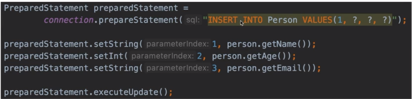

#### SQL инъекции. PreparedStatement

1. `SQL инъекция`, самый распростраенный способ взлома сайтов и программ, работающих с БД. (данная строка из img, удалит
   нашу таблицу с данными из БД)
   

2. `PreparedStatement`, должно использовать в JDBC API для всех запросов, где содержатся данные, полученные от
   пользователя. SQL запрос компилируется один раз и не может быть изменен. Данные от пользователя могут быть вставлены
   лишь в указанные места запроса и не могу изменить сам SQL запрос.  (решение проблемы)
   

